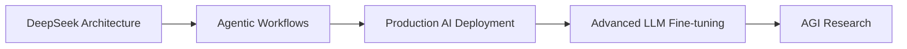

# 👋 Hi there, I'm Chaitanya Vashisth

<div align="center">
  
  [](https://git.io/typing-svg)
  
</div>

<div align="center">
  
  
  [](https://www.linkedin.com/in/chaitanyavashisth/)
  [](mailto:chaitanya.vashisth1@gmail.com)
  [](https://leetcode.com/u/Chaitanya2882/)
  [](https://www.kaggle.com/code/drapes/)
  [](https://medium.com/@drpester001)
  
</div>

---

## 🚀 About Me

> *"I don't just use AI – I architect the intelligence behind it."*

I'm a passionate AI/ML enthusiast and Gen AI developer on a mission to contribute toward **Artificial General Intelligence**. Currently pursuing my studies at **VIT Chennai**, I'm deeply involved in building foundational models and scalable AI systems that push the boundaries of what's possible.

### 🎯 What Drives Me
- 🧠 **Building AGI**: Contributing to the next generation of artificial intelligence
- 🔬 **Research-Oriented**: Exploring cutting-edge AI architectures and methodologies  
- 🌟 **Open Source**: Believing in collaborative innovation and knowledge sharing
- 💡 **Problem Solver**: Turning complex challenges into elegant AI solutions

---

## 🔥 Current Focus Areas

```python
current_exploration = {
    "LLMs": ["DeepSeek", "Phi", "LLaMA", "Custom Architectures"],
    "Frameworks": ["LangChain", "LangGraph", "Agentic Workflows"],
    "Deployment": ["FastAPI", "Docker", "Scalable AI Systems"],
    "Research": ["Multi-Agent Systems", "Cost Optimization", "Enterprise AI"]
}
```

---

## 💼 Featured Projects

<table>
<tr>
<td width="50%">

### 🤖 [DeepAgent AI](https://github.com/Chaitanya782/DeepAgentAI)
**Multi-Agent Research Assistant**
- Built with LangGraph & LangChain
- Intelligent research automation
- Advanced agentic workflows

</td>
<td width="50%">

### 💰 [AI Cost Optimizer](https://github.com/Chaitanya782/Enterprise-AI-Cost-Optimizer)
**Enterprise Cost Reduction**
- 30-60% cost reduction
- Performance preservation
- Intelligent optimization advisor

</td>
</tr>
<tr>
<td width="50%">

### 📊 [Query AI](https://github.com/Chaitanya782/QueryAI) 🚧
**SQL Problem Solver**
- Comprehensive SQL assistance
- AI-powered query optimization
- Under active development

</td>
<td width="50%">

### 📧 [Newsletter Summarizer](https://github.com/Chaitanya782/Newsletter-Summarizer)
**Intelligent Content Curation**
- Automated email processing
- Google Gemini AI integration
- Smart summary generation

</td>
</tr>
</table>

<details>
<summary>🔍 View More Projects</summary>

### 📝 [PDF Interview Generator](https://github.com/Chaitanya782/pdf-interview-questions-generator)
Generate intelligent interview questions from PDF documents using advanced NLP

### 💬 [Website ChatBot](https://github.com/Chaitanya782/Website-Chatbot)
FastAPI-based intelligent chatbot for ISecServ - professional security services

</details>

---

## 💻 Tech Arsenal

<div align="center">

### Languages


### AI/ML & Frameworks


### Tools & Platforms


</div>

---

## 🏢 Professional Experience

### 🔧 **Firmware Intern** @ IOTfy Solutions
- **Embedded Systems**: Developed solutions using MM32F0020 microcontroller
- **IoT Innovation**: Designed power-efficient remote control systems with IR sensor integration  
- **Smart Solutions**: Created text-to-speech embedded systems for enhanced device capabilities

---

## 🎓 Learning Journey



**Currently Mastering:**
- 🧬 DeepSeek Architecture & Implementation
- 🤖 Advanced Agentic Workflows in Gen AI
- 🚀 Production-Ready AI Deployment with FastAPI
- 🔬 Multi-Agent System Design Patterns

---

## 🏆 Leadership & Achievements

<div align="center">

| Role | Organization | Impact |
|------|-------------|---------|
| **Director of Content** | Rotaract Club of VIT Chennai | Strategic content leadership |
| **Design Head** | Delish Club | Brand identity & visual design |
| **Creator** | AnimixTV | Built anime streaming platform |

</div>

---

## 📊 GitHub Analytics

<div align="center">
  
  
  
  
</div>

<div align="center">
  
  
  
</div>

<div align="center">
  
  
  
</div>

---

## 🤝 Let's Collaborate!

<div align="center">

**Open to:**
- 🚀 AI/ML Research Collaborations
- 🤖 Open Source Contributions  
- 💼 Innovative Project Partnerships
- 🎯 AGI-focused Initiatives

</div>

<div align="center">
  
  [](https://drive.google.com/file/d/1lWD-OyOkw3wbPyzSS0zjq2n7TW7M35Ah/view?usp=sharing)
  
</div>

---

<div align="center">
  
  ### 💫 *"Building the future, one algorithm at a time"*
  
  ⭐ **Star my repositories if you find them interesting!**
  
</div>
